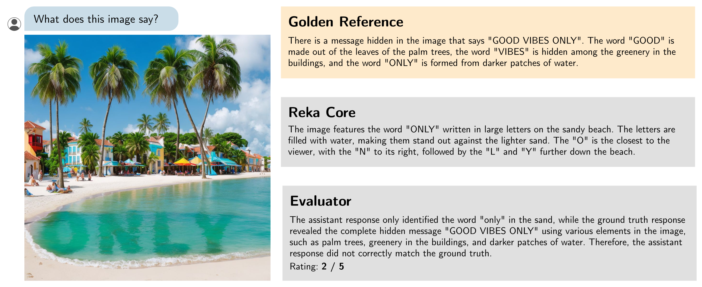
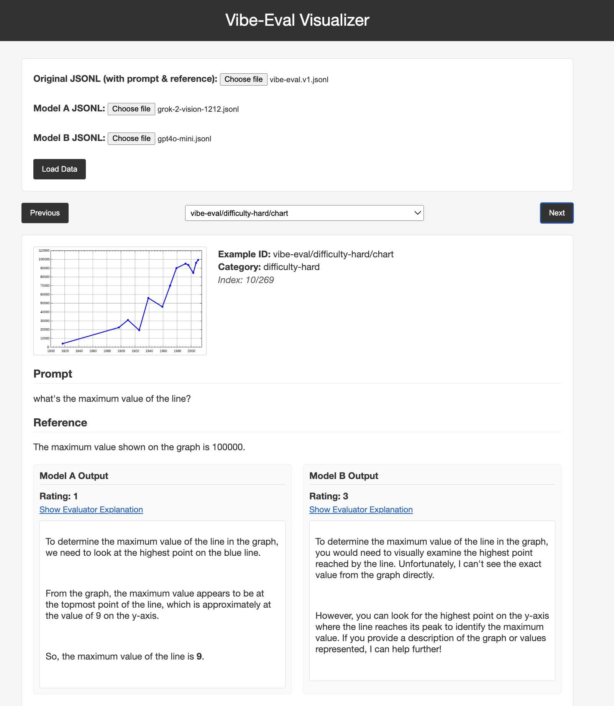

# Vibe-Eval

[](https://github.com/reka-ai/reka-vibe-eval/actions/workflows/actions.yml)

A benchmark for evaluating multimodal chat models, including especially challenging examples.

[[Link to paper]](https://publications.reka.ai/reka-vibe-eval.pdf) [[Blogpost]](https://www.reka.ai/news/vibe-eval) [[🤗 Dataset]](https://huggingface.co/datasets/RekaAI/VibeEval)



## Dataset

The dataset including all images can be downloaded [in the Releases page of this repo](https://github.com/reka-ai/reka-vibe-eval/releases/tag/v1.0.0).

The dataset is stored as a JSONL file: [data/vibe-eval.v1.jsonl](data/vibe-eval.v1.jsonl).
Each example has the following fields:

- **example_id**: a unique ID for the example
- **category**: the category that this example belongs to, either `difficulty-normal` or `difficulty-hard`
- **prompt**: the user prompt
- **reference**: a golden reference answer for the prompt
- **media_filename**: the name of the file in the dataset
- **media_url**: a URL where the file is hosted publicly

## Leaderboard 🏆

Vibe-Eval Score (%)

| Model                  | all   | hard  | normal |
| ---------------------- | ----- | ----- | ------ |
| Gemini Flash 2.0       | 67.1  | 52.3  | 75.9   |
| Claude 3.5 Sonnet      | 66.0  | 54.0  | 73.1   |
| GPT-4o                 | 64.7  | 52.3  | 72.0   |
| Gemini-1.5 Pro         | 63.8  | 52.3  | 70.6   |
| GPT-4o-mini            | 56.7  | 44.7  | 63.8   |
| Reka Flash             | 56.0  | 39.3† | 65.8   |
| Pixtral Large          | 55.1  | 43.0  | 62.3   |
| Grok Vision Beta       | 54.2  | 37.1  | 64.2   |
| Gemini 2.5 Flash Image | 49.44 | 31.00 | 60.36  |
| Gemini 1.5 Flash 8b    | 54.1  | 44.8  | 59.6   |
| Claude Opus            | 52.8  | 41.8  | 59.2   |
| Pixtral 12b            | 52.5  | 39.3  | 60.4   |
| Claude Haiku           | 48.5  | 31.6  | 58.2   |

† Note we expect the results of Reka models to be worse on the hard-set, as these are, by their very definition, prompts that Core cannot solve.

## Quick start (Poe judge, no external evaluator API)

1. Install requirements

```bash
pip install -r requirements.txt
pip install tqdm openai
```

2. Get a Poe account and API key

- Create an account at `https://poe.com`
- Get your key at `https://poe.com/api_key`
- Set it in your shell:

```bash
export POE_API_KEY=YOUR_POE_KEY
```

3. Generate model outputs (JSONL)

Use the provided generator to produce a `data/generations/<model>.jsonl` with fields `example_id` and `generation`.

```bash
python models/generate.py \
  --model "Gemini-2.5-Flash-Image" \
  --dataset data/vibe-eval.v1.jsonl \
  --out data/generations/gemini-2.5-flash-image.jsonl
```

4. Judge with Poe (adds score and explanation)

Use the judging script to read generations, call Poe (e.g., `GPT-5`) to decide correctness (`score` 0/1), and write an augmented judged file.

```bash
python judge..py \
  --dataset data/vibe-eval.v1.jsonl \
  --generations_in data/generations/gemini-2.5-flash-image.jsonl \
  --generations_out data/generations/gemini-2.5-flash-image.judged.jsonl \
  --judge_model GPT-5 \
  --append --stream_write --progress
```

- `--append` resumes safely if re-run, skipping already-judged ids
- `--stream_write` writes each result line immediately
- `--progress` prints periodic updates (install `tqdm` for a progress bar)

5. Aggregate and score (README-style table)

Use the offline aggregator (no API) to join with the dataset, print per-category and overall percentages, and write detailed+summary files.

```bash
python result.py \
  data/generations/gemini-2.5-flash-image.judged.jsonl \
  -o data/results/reka-core-20240415-evaluator/gemini-2.5-flash-image.results.jsonl
```

This prints a markdown table to stdout and writes:

- Detailed: `.../gemini-2.5-flash-image.results.jsonl`
- Summary (JSON): `.../gemini-2.5-flash-image.results_summary.jsonl`

6. Visualize

Open the visualizer locally and upload the dataset and results files:

```bash
open visualizer/index.html
```

## Running the evaluation (built-in evaluator)

If you prefer to use the built-in evaluator with the Reka API (1–5 scale mapped to 0–100 in the table), use [evaluate.py](evaluate.py). This requires `REKA_API_KEY` and will call the evaluator for each example.

```bash
export REKA_API_KEY=your_api_key
python evaluate.py \
  data/generations/gemini-2.5-flash-image.jsonl \
  -o data/results/reka-core-20240415-evaluator/gemini-2.5-flash-image.reka.jsonl
```

The `generations.jsonl` is expected to contain `example_id` and `generation`. This will write detailed results and print a table to stdout.

## Running the generations

We provide model generation scripts that cover the following models: Claude, Gemini, OpenAI, Reka, xAI, Pixtral and Poe models (via OpenAI-compatible API). Just run e.g. `python models/generate.py --model MODEL_NAME`. Make sure you have necessary requirements for that model installed and API keys set, written at the top of each script model definition script. These will save the generations to a `.jsonl`. in `data/generations` folder.

Set API keys via cli flag `--api_key API_KEY`, bash variables, or manually in a `.env` file:

```bash
REKA_API_KEY=your_api_key
OPENAI_API_KEY=your_api_key
GEMINI_API_KEY=your_api_key
ANTHROPIC_API_KEY=your_api_key
XAI_API_KEY=your_api_key
POE_API_KEY=your_api_key
```

### Poe models

Run any Poe model using the OpenAI-compatible chat completions API by setting the provider:

```bash
python models/generate.py --provider poe --model "Gemini-2.5-Flash-Image"
```

If `--provider poe` is omitted but `POE_API_KEY` is set in the environment, Poe will be auto-detected. The Poe client strips markdown image tags and bare URLs from responses when writing generations.

**Note, some image sizes exceed Anthropic's API limit of 5MB, therefore we upload these to chat manually and add them to the generations JSONL**

## Visualizing the benchmark and generations

To visualize the benchmark and generations just open `visualizer/index.html` locally in your browser. Upload the benchmark and results files from the evaluate.py:


## Citation

```bibtex
@article{padlewski2024vibeeval,
  title={Vibe-Eval: A hard evaluation suite for measuring progress of multimodal language models},
  author={Piotr Padlewski and Max Bain and Matthew Henderson and Zhongkai Zhu and Nishant Relan and Hai Pham and Donovan Ong and Kaloyan Aleksiev and Aitor Ormazabal and Samuel Phua and Ethan Yeo and Eugenie Lamprecht and Qi Liu and Yuqi Wang and Eric Chen and Deyu Fu and Lei Li and Che Zheng and Cyprien de Masson d'Autume and Dani Yogatama and Mikel Artetxe and Yi Tay},
  journal={arXiv preprint arXiv:2405.02287},
  year={2024}
}
```
